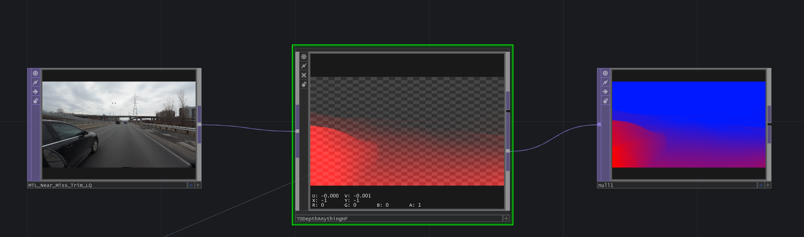

# TDPyEnvDepthAnything - an easier setup for DepthAnything with TensorRT

> ⚠️ This is an early release that will require TouchDesigner ("POPs Alpha") build 2023.32474+

TouchDesigner implementation for Depth Anything v2 with TensorRT, with the latest TouchDesigner tools
- 🤗 HuggingFace model download and Transformers
- Using TouchDesigner's TDPyEnvManager
- Using TouchDesigner's ThreadManager
- TouchDesigner 2023.30k+

Original code by Oleg Chomp (@olegchomp) and update by JetXS (Michel Didier, Derivative)

## Features
* One click install and run script
* In-TouchDesigner model download, acceleration and inference
  
## Usage
Tested with TouchDesigner 2023.30k+

## Install:
1. Open the project, open the textport if not opened
2. On the TDPyEnvManager, click on "Create from requirements.txt"
3. Wait a bit while environment is being setup
3. On TDDepthAnything, click Download Model
5. Once done, click on Accelerate, this will take a few minutes, go get a cup of tea
6. Once done, click on Upload Model to GPU
7. Turn on Active par and have fun

Note: Next time you start the project, just click on Upload Model to GPU and turn on Active par

## Portability:
In any other project:
* Add the TDPyEnvManager
* Add the requirements.txt next to your .toe file
* Add the TDDepthAnything COMP in your project
* On the TDPyEnvManager, click on "Create from requirements.txt"
* ... Follow previous install steps, or move checkpoints folder.

## Acknowledgement
Based on the following projects:
* [TDDepthAnything](https://github.com/olegchomp/TDDepthAnything) - Depth-Anything TensorRT in TouchDesigner
* [Depth-Anything](https://github.com/LiheYoung/Depth-Anything) - Unleashing the Power of Large-Scale Unlabeled Data.
* [Depth-Anything TensorRT C++](https://github.com/spacewalk01/depth-anything-tensorrt) - Leveraging the TensorRT API for efficient real-time inference.
* [TopArray](https://github.com/IntentDev/TopArray) - Interaction between Python/PyTorch tensor operations and TouchDesigner TOPs.
